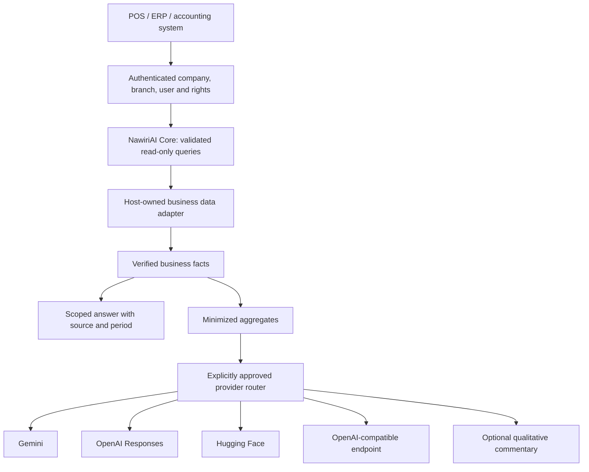

# NawiriAI

Open-source AI Business Intelligence infrastructure for SMEs.

v0.1.0 is the first public developer preview.

NawiriAI provides a secure, provider-neutral intelligence layer between business systems and AI models. SMEs can ask questions, generate insights and understand operational data without coupling their business software to a single AI vendor.

Business figures come from trusted, deterministic tools. Language models explain a bounded set of results; they never execute SQL or change transactions.



## Quick start

Install a .NET 8 SDK or a compatible newer SDK with the .NET 8 runtime.

```sh
dotnet restore NawiriAI.sln
dotnet build NawiriAI.sln -c Release --no-restore
dotnet test NawiriAI.sln -c Release --no-build
dotnet run --project samples/NawiriAI.SampleBusiness -- --date 2026-09-12 "What were my sales this month?"
dotnet run --project samples/NawiriAI.SampleBusiness -- --date 2026-09-12 "What are my top 10 products this month?"
dotnet run --project samples/NawiriAI.SampleBusiness -- --date 2026-09-12 "Compare sales this month with last month."
```

The default demo runs locally with synthetic records and deterministic answers. No API key or business database is required. See [demo examples](docs/examples/console-demo.md) for the dataset and expected facts.

## Capabilities

The registry describes 25 business concepts, including sales, product rankings, category profitability, inventory, receivables, expenses and daily briefs. Each adapter explicitly declares its supported tools. Unsupported information returns a capability error instead of invented figures. The synthetic connector demonstrates multiple tools; production connectors must use their host's validated calculations.

Natural language supports a deliberately bounded vocabulary: today, yesterday, this week, last week, this month and last month. Dates use the business time zone. Monthly comparisons use month-to-date against the full previous month and explicitly label both periods; these are not like-for-like growth measurements. Use the structured query endpoint for explicit calendar ranges.

## Providers

| Provider ID | Implementation | Setup |
|---|---|---|
| `gemini` | Gemini OpenAI-compatible API | [Gemini](docs/providers/gemini.md) |
| `openai` | OpenAI Responses API | [OpenAI](docs/providers/openai.md) |
| `huggingface` | Hugging Face inference router | [Hugging Face](docs/providers/huggingface.md) |
| `local` | OpenAI-compatible inference | [Compatible endpoints](docs/providers/local.md) |

Set `NAWIRIAI_PROVIDER`, `NAWIRIAI_MODEL`, and `NAWIRIAI_API_KEY` in the process environment or your secret manager. Set `NAWIRIAI_DATA_SHARING_APPROVED=true` only for an endpoint you have authorized. `NAWIRIAI_ENDPOINT` optionally supplies the complete inference URL. Models are administrator supplied; no model is permanently hard-coded. Connection probes can consume provider quota. Streaming and model-driven tool execution are not implemented in v0.1.

If enrichment fails, the answer still contains verified facts. The application keeps commentary separate and rejects commentary containing numerical characters, so it cannot replace displayed totals. Qualitative commentary can still be wrong and should be checked against the facts.

## Authenticated demo API

The API host serves synthetic data only. Its bearer token maps to a fixed demo identity on the server. It refuses to start until demo mode is explicitly enabled and a token of at least 32 characters is supplied. Production hosts must replace the authentication/context adapter.

PowerShell:

```powershell
$env:NAWIRIAI_DEMO_MODE = 'true'
$demoTokenBytes = New-Object byte[] 32
$demoRng = [Security.Cryptography.RandomNumberGenerator]::Create()
$demoRng.GetBytes($demoTokenBytes)
$demoRng.Dispose()
$env:NAWIRIAI_DEMO_TOKEN = [Convert]::ToBase64String($demoTokenBytes)
$env:NAWIRIAI_DEMO_DATE = '2026-09-12'
dotnet run --project src/NawiriAI.Api -- --urls http://127.0.0.1:5088
```

In a second shell, supply that token through your environment:

```powershell
$headers = @{ Authorization = "Bearer $env:NAWIRIAI_DEMO_TOKEN" }
Invoke-RestMethod http://127.0.0.1:5088/api/v1/chat -Method Post -Headers $headers -ContentType application/json -Body '{"question":"What were my sales this month?"}'
```

Endpoints: `GET /api/v1/health` (public readiness), `GET /api/v1/providers`, `POST /api/v1/chat`, `POST /api/v1/query`, `GET /api/v1/insights/daily`, and `GET /api/v1/business-health`. All business endpoints require authentication and are rate limited. See [API details](docs/integration/api.md).

The Docker image listens on port 7860 for a future Hugging Face Spaces deployment. Supply the demo token as a runtime secret. Never bake keys into an image; use TLS at the hosting boundary.

## Integrate another business system

Implement `IBusinessDataProvider` using trusted application services. Every call receives a `BusinessSecurityContext` constructed by the authenticated host. Validate it again at the storage boundary, and return scoped DTOs. Register the adapter with `IntelligenceService` and an `IAIProviderRouter`. See the [integration contract](docs/integration/business-data-provider.md) and [NawiriPro boundary](docs/integration/nawiripro.md).

Public database-specific connectors are not included in v0.1. MySQL, PostgreSQL, SQLite and REST adapters can implement the same boundary without exposing schema details to the model.

## Security and project policy

- [Architecture](ARCHITECTURE.md), [security](SECURITY.md), and [data fencing](docs/security/data-fencing.md)
- [Provider data privacy](docs/security/provider-data-privacy.md)
- [Roadmap](ROADMAP.md), [contributing](CONTRIBUTING.md), and [code of conduct](CODE_OF_CONDUCT.md)
- [Apache-2.0 license](LICENSE) and [third-party notices](THIRD_PARTY_NOTICES.md)

Created by SoftByte Technologies Limited. NawiriPro is the first proprietary integration; NawiriAI does not require NawiriPro. No proprietary product code, production data or original product Git history belongs in this repository.
